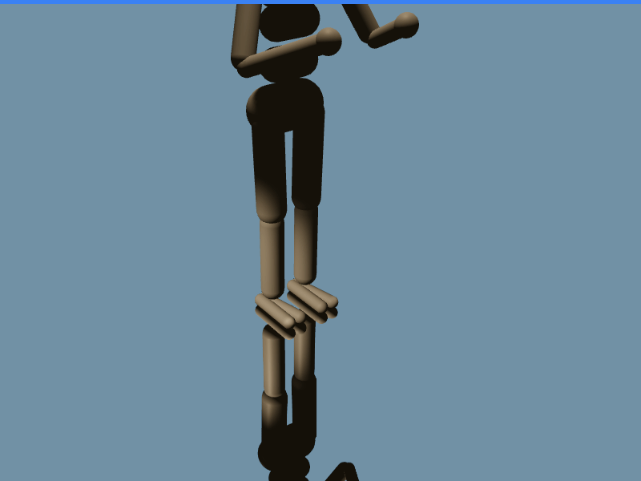

# MuJoCo Web

MuJoCo Web is a repository dedicated to compiling MuJoCo (Multi-Joint dynamics with Contact) into WebAssembly (WASM) for seamless execution within a React web application. 

This project is tailored for Linux Ubuntu 22.04 environments and aims to facilitate interactive physics simulations directly in the browser.

## Status



MuJoCo 3.2.4 builds currectly into WASM with patches.

The React application loads a sample Mujoco scene and runs the simulation.

## Inspiration

This project draws inspiration from the following repositories:

https://github.com/stillonearth/MuJoCo-WASM

https://github.com/zalo/mujoco_wasm

These projects provided foundational insights and methodologies that have been adapted and expanded upon to suit the objectives of MuJoCo Web.

## Prerequisites to compile MuJoCo into WebAssembly

Before proceeding with the build process, ensure you have the [Emscripten](https://emscripten.org/index.html) compiler installed and the EMSDK environment variable set.

```bash
git clone https://github.com/emscripten-core/emsdk.git
cd emsdk/
git pull
./emsdk install latest
./emsdk activate latest
source ./emsdk_env.sh
```

Append a command at the end of your `.bash_profile` to source EMSDK automatically.

```bash
source "/path-ro-emsdk//emsdk_env.sh"
```

## How to compile and install MuJoCo WebAssembly binary

In the root folder, execute the following commands:

```bash
emcmake cmake -Bbuild -H.
cmake --build build
cmake --install build
```

These commands will performs the following actions:

* Downloads all required packages.
* Applies necessary patches to the source code.
* Compiles MuJoCo web into WebAssembly including all libraries.
* Install the binary into the /public/wasm/ folder.

### Key Steps in the Build Process:

**Dependency Management**

MuJoCo relies on the [CCD](https://github.com/danfis/libccd) (Collision Detection) library for its physics computations. By default, MuJoCo fetches and builds the CCD library as part of its CMake build process.

**Patching the CCD Library**

To eliminate external dependencies on the LM (Linear Math) library—which is already included in Emscripten—the CCD library must be patched. This involves modifying the CCD source code to remove references to the external LM library.

**Precompiling the CCD Library**

To streamline the build process and avoid fetching and building CCD from source each time, the CCD library is compiled separately. MuJoCo is then configured to utilize this precompiled version instead of fetching it during the build.

**Configuring MuJoCo to Use the Precompiled CCD Library**

The build scripts are adjusted to prevent MuJoCo from fetching the CCD library automatically. Instead, MuJoCo is instructed to link against the precompiled CCD library, ensuring compatibility and reducing build times.
